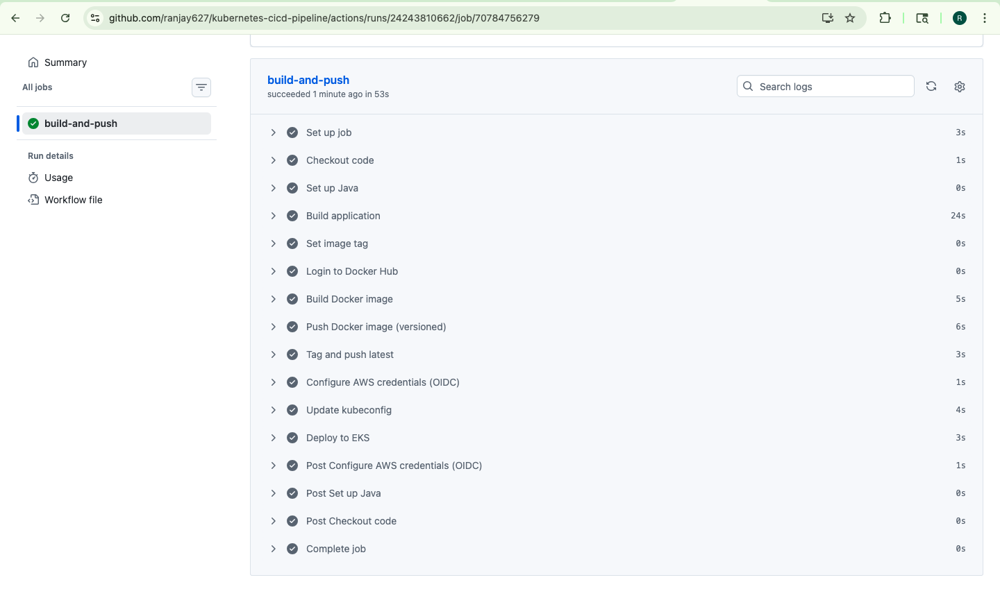
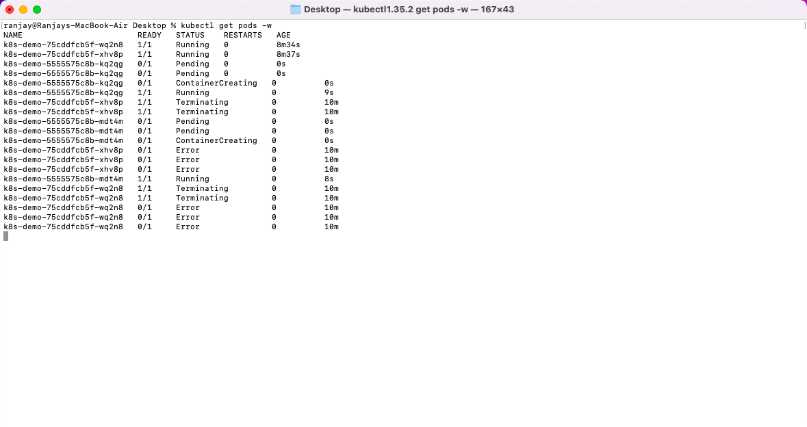
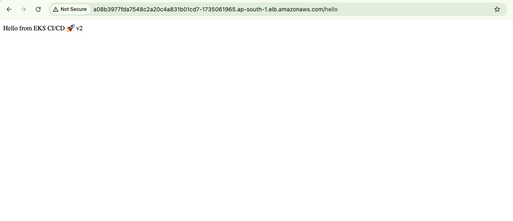
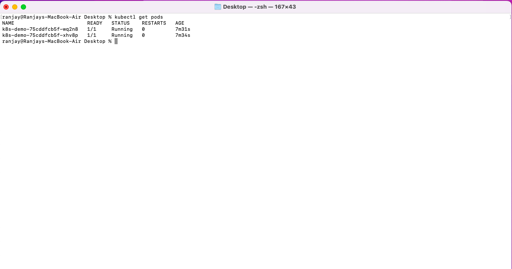
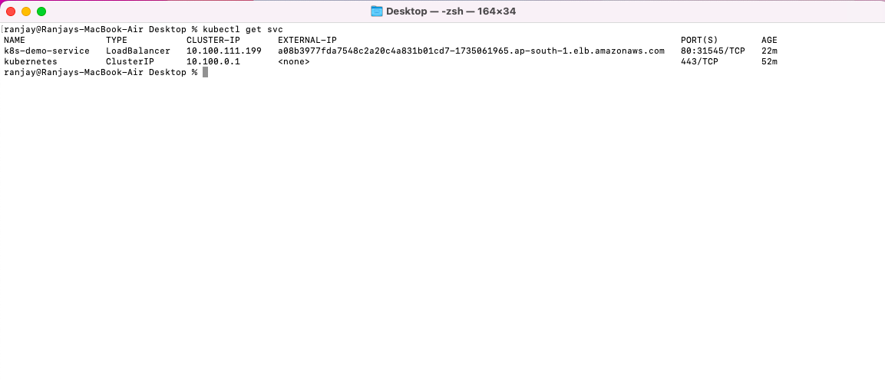

# Kubernetes CI/CD Pipeline with AWS EKS 🚀

This project demonstrates a **production-grade CI/CD pipeline** that automatically builds, containerizes, and deploys a Spring Boot application to **AWS EKS** using **GitHub Actions** with **secure OIDC authentication (no AWS credentials stored)**.

---

## 🧠 Architecture

Code → GitHub Actions → Docker Build → Docker Hub → AWS EKS → Kubernetes Deployment

- GitHub Actions handles CI/CD automation  
- Docker Hub stores versioned images  
- AWS EKS runs the application  
- Kubernetes performs rolling updates  

---

## 🔄 CI/CD Flow

1. Push code to `main` branch  
2. GitHub Actions builds Spring Boot application  
3. Docker image is created and tagged with commit SHA  
4. Image is pushed to Docker Hub  
5. GitHub Actions authenticates to AWS using OIDC  
6. Kubernetes deployment is updated using `kubectl`  
7. Kubernetes performs rolling update (zero downtime)

---

## 🔐 Security (Industry Best Practice)

- Uses **OIDC (OpenID Connect)** for AWS authentication  
- No AWS credentials stored in GitHub  
- Uses **IAM Role assumption with temporary credentials**  
- Follows **least privilege and secure access principles**

---

## 📸 CI/CD Execution Proof

### CI/CD Pipeline Success

### Kubernetes Rolling Update

### Application Updated via CI/CD

---

## ⚙️ Kubernetes Deployment Details

### Pods Running in EKS

### Service (LoadBalancer)

### Application Accessible via LoadBalancer

---

## ⚙️ Tech Stack

- Java (Spring Boot)
- Docker
- Kubernetes (AWS EKS)
- GitHub Actions
- AWS IAM (OIDC Authentication)

---

## 💡 Key Features

- Automated CI/CD pipeline  
- Secure AWS authentication (OIDC, no secrets)  
- Versioned Docker images using commit SHA  
- Zero-downtime deployment (rolling updates)  
- Path-based pipeline trigger optimization  
- Fully cloud-native deployment  

---

## 🚀 How It Works

Any change in the application or Docker configuration automatically triggers the pipeline:

- Builds a new Docker image  
- Pushes it to Docker Hub  
- Deploys it to AWS EKS  
- Updates running application with zero downtime  

---

## 📁 Project Structure
kubernetes-cicd-pipeline/
├── app/ # Spring Boot application
├── docker/ # Dockerfile
├── k8s/ # Kubernetes manifests
├── .github/workflows/ # CI/CD pipeline
├── screenshots/ # Proof images
└── README.md

---

## 👨‍💻 About Me

I am a **DevOps and Cloud Engineer** specializing in:

- Kubernetes (EKS)
- CI/CD automation
- Cloud-native architectures
- Secure infrastructure design

This project demonstrates my ability to design and implement **production-ready deployment pipelines**.

---

## 🔥 Key Highlight

This project showcases a **complete DevOps lifecycle**:

Code → Build → Docker → Push → Deploy → Live Application

---
